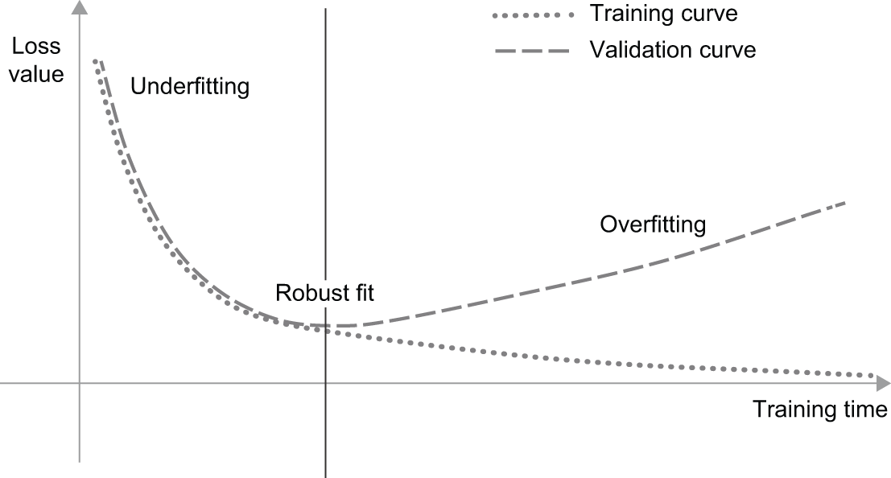
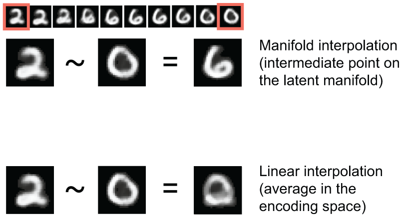

## Learning objectives

-   Understand the tension between optimization and generalization
-   Choose appropriate model evaluation strategies
-   Learn some regularization techniques to improve generalization

## Optimization vs generalization

The fundamental tension in machine learning:

- **Optimization**: Adjusting the model to perform well on *training data*
- **Generalization**: How well the model performs on *data it has never seen*

> These two goals are at odds — and managing this tension is what ML is all about.

::: notes
- Early in training, both improve together (underfitting regime)
- After a point, training loss keeps falling but validation loss plateaus or rises
- That inflection point is where overfitting begins
:::

## Underfitting vs overfitting

{fig-align="center" height="300"}

- Both curves drop together (underfitting), then diverge (overfitting)
- The "robust fit" point is where we want to stop
- This pattern is universal across all model types and datasets

::: notes
- The goal is to find and stop at the sweet spot
- We'll see tools for this: early stopping, regularization
- The key diagnostic: compare training vs validation metrics
:::

## Why models overfit

Three main sources:

1. **Noisy training data** — mislabeled samples or invalid inputs cause memorization of outliers
2. **Ambiguous features** — input regions that map to multiple classes; model becomes overconfident
3. **Rare features → spurious correlations** — uncommon values create false associations

::: notes
- MNIST experiment in the book: adding 784 white noise channels degraded validation accuracy by ~1%
- The noise channels had no information, but the model found accidental patterns
- Shuffled-label experiment: model memorized random labels perfectly — zero generalization
:::

## The manifold hypothesis

- Real-world data lives on low-dimensional **manifolds** within high-dimensional space
- These manifolds are smooth and continuous — you can morph one sample into another

{fig-align="center" height="200"}

- Generalization via **interpolation**

::: notes
- Example: images of faces form a manifold — you can smoothly transition between faces
- Not all points in pixel space are valid faces; valid ones cluster on a subspace
- Gradient descent's smooth, incremental nature helps capture manifold structure
- "Training data is paramount" — you need dense sampling near decision boundaries
:::

## Evaluating models: The three sets

| Set | Purpose | When used |
|-----|---------|-----------|
| **Training** | Fit model parameters | Every epoch |
| **Validation** | Tune hyperparameters, detect overfitting | During development |
| **Test** | Final unbiased evaluation | Once, at the very end |

- Never tune anything based on test set performance
- Information "leaks" from validation set into the model via your decisions

::: notes
- Every time you use validation performance to make a decision, information leaks
- The test set must remain truly untouched until final evaluation
- In Kaggle: validation = your local eval, test = the leaderboard
:::

## Three evaluation protocols

**1. Simple hold-out**: Fixed train/val/test split

- Fast, but unreliable with small datasets

**2. K-fold cross-validation**: Split data into K parts, rotate validation set

- More reliable; average K results

**3. Iterated K-fold with shuffling**: Repeat K-fold P times, reshuffle each time

- Most reliable; costs P × K model trainings

::: notes
- K=4 or K=5 is common
- Iterated K-fold is gold standard for small datasets
- For large datasets, simple hold-out is usually fine
:::

## Evaluation pitfalls

- **Data representativeness**: Always shuffle before splitting
- **Temporal ordering**: For time-series,  validate on future data only
- **Redundancy**: Ensure no overlap between train and validation (e.g., duplicate photos)
- **Baseline**: Always beat a common-sense baseline before celebrating

::: notes
- Temporal leaks are a classic mistake: training on future data to predict the past
- Redundancy: if the same patient appears in train and val, you're testing memorization
- Common-sense baseline examples: majority-class classifier, last-value predictor
:::

## Improving model fit

Three problems you'll encounter:

**1. Training loss doesn't decrease**

- Learning rate too high (overshooting) or too low (stalling)

**2. Training works but model doesn't generalize**

- Data may lack predictive information, or architecture is wrong

**3. Can't achieve overfitting**

- Model is too small — increase layers or layer sizes

::: notes
- Achieving overfitting first is a key milestone — it proves your pipeline works
- If you can't overfit, the problem is capacity, not regularization
- Architecture choice matters: use convnets for images, recurrent/transformers for sequences
:::

## Improving generalization: Data

- **Collect more data** — the single most effective thing you can do
- **Minimize labeling errors** — garbage in, garbage out
- **Clean your data** — handle missing values, remove duplicates
- **Feature selection** — drop irrelevant features that add noise

::: notes
- Dense sampling of the input space is what enables interpolation
- More data is almost always better than a fancier model
- Cleaning data is unglamorous but high-impact
:::

## Feature engineering

Applying **domain knowledge** to create better input representations:

- Reading a clock: raw pixels → polar coordinates of the hands → time
- Deep learning reduces the need, but doesn't eliminate it

**Good features still help because they:**

1. Let you solve problems with less data
2. Enable simpler, more elegant models

::: notes
- Before deep learning, feature engineering was ~90% of the work
- Deep learning automates much of it, but domain knowledge still helps
- Example: for house prices, "price per square foot" > raw price + raw area
:::

## Early stopping

Interrupt training when validation metrics stop improving:
(We will learn this in chapter 7)
```python
callbacks_list = [
    keras.callbacks.EarlyStopping(
        monitor="val_loss",
        patience=2,
    ),
    keras.callbacks.ModelCheckpoint(
        filepath="best_model.keras",
        monitor="val_loss",
        save_best_only=True,
    )
]
```

- `patience`: how many epochs to wait before stopping
- `ModelCheckpoint`: saves the best model automatically

::: notes
- This is the simplest and most effective regularization technique
- Always use both callbacks together — early stopping + checkpoint
- The "best" model is from the epoch with lowest validation loss, not the last epoch
:::

## Regularization: Reducing model size

- Fewer parameters = fewer things to memorize
- Forces the model to learn **compressed**, generalizable representations

| Model | Behavior |
|-------|----------|
| Too small | Underfits — can't capture the patterns |
| Too large | Overfits — memorizes training data |
| Just right | Generalizes well |

- Start small, increase capacity until overfitting, then regularize

::: notes
- There's no formula for the right size — it's empirical
- The book's heuristic: start with a model that overfits, then shrink/regularize
- "Occam's razor" — simplest model that fits the data
:::

## Regularization: Weight regularization

Add a penalty to the loss for large weight values:

- **L1**: Penalty ∝ |w| — drives weights to exactly zero (sparse)
- **L2** (weight decay): Penalty ∝ w² — drives weights toward zero (small)

```python
layers.Dense(16, activation="relu",
             kernel_regularizer=regularizers.l2(0.002))
```

- `0.002` means: add `0.002 * weight_value²` to the total loss per weight

::: notes
- L2 is more common in practice — also called "weight decay"
- L1 produces sparse models (some weights become exactly 0) — useful for feature selection
- The penalty coefficient is a hyperparameter to tune
- Particularly effective for smaller models
:::

## Regularization: Dropout

Randomly zero out a fraction of layer outputs during training:

```python
model = keras.Sequential([
    layers.Dense(16, activation="relu"),
    layers.Dropout(0.5),
    layers.Dense(16, activation="relu"),
    layers.Dropout(0.5),
    layers.Dense(1, activation="sigmoid")
])
```

- Typical rates: 0.2 to 0.5
- At test time: no dropout, outputs scaled by (1 − rate)
- Prevents "conspiracies" — accidental patterns that don't generalize

::: notes
- Intuition: forces each neuron to be useful on its own, not rely on specific partners
- Like training an ensemble of sub-networks that share weights
- Dropout is one of the most effective and widely used techniques
- Only applied during training — `model.evaluate()` and `model.predict()` don't use it
:::

## Discussion questions

1. Why does adding random noise features hurt generalization even though the model could just ignore them?
2. When would you choose K-fold over simple hold-out validation?
3. Should you always prefer a smaller model, or are there cases where bigger is better?

::: notes
- Noise features: the model finds spurious correlations — it can't tell signal from noise
- K-fold: small datasets, high-stakes decisions, when variance in results matters
- Bigger models + strong regularization can outperform smaller ones (modern trend)
:::
